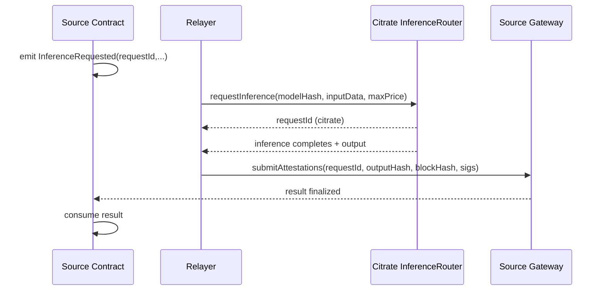

# Cross-Chain Data Bridge Protocol

This document defines the protocol for cross-chain inference requests that originate on external chains and are executed on Citrate. It is a tutorial-level reference intended for smart contract developers and relayer operators.

## Goals

- Allow source-chain contracts to request Citrate inference and receive results deterministically
- Provide verifiable, replay-resistant result delivery back to the source chain
- Keep message formats explicit and minimal to reduce ambiguity

## Scope

- Source chain contract emits request events
- Relayers forward requests to Citrate and post attestations back
- Citrate inference uses `InferenceRouter` as the canonical on-chain request store
- Source chain gateway verifies attestations and releases results

This protocol does not define how model weights are hosted or how compute providers are selected beyond the `InferenceRouter` contract behavior.

## Actors

- Source Contract: emits request event, consumes finalized result
- Source Gateway: validates attestations and stores results
- Relayer Network: listens for events and submits transactions
- Citrate Inference Router: accepts requests and records outputs

For Solana, the Source Gateway is an on-chain program that stores request and output accounts.

## Request Lifecycle

1. Source contract emits `InferenceRequested` with request metadata
2. Relayer builds a Citrate transaction to `requestInference`
3. Compute providers finalize the inference on Citrate
4. Relayers attest the Citrate result (block + requestId + output hash)
5. Relayers submit `outputData` and attestations to the source gateway
6. Source contract reads the result and proceeds

For Solana, the source program reads the request account to consume output data.

## Message Formats

### Source Chain Request Event

```solidity
event InferenceRequested(
    bytes32 indexed requestId,
    address indexed requester,
    bytes32 indexed modelHash,
    bytes32 inputHash,
    uint256 maxPrice,
    uint256 deadline,
    address callbackTarget,
    bytes4 callbackSelector
);
```

Required fields:

- `requestId`: source-chain unique ID (caller + nonce or deterministic hash)
- `requester`: original caller
- `modelHash`: model identifier (matches Citrate model registry)
- `inputHash`: keccak256 of input payload (payload is stored in gateway state)
- `maxPrice`: maximum acceptable cost (SALT equivalent) for Citrate request
- `deadline`: source chain timestamp after which results are rejected
- `callbackTarget`: contract to receive the result callback (optional, can be zero)
- `callbackSelector`: function selector for callback (optional, can be 0x00000000)

### Source Gateway Request

```solidity
function requestInference(
    bytes32 modelHash,
    bytes calldata inputData,
    uint256 maxPrice,
    uint256 deadline,
    address callbackTarget,
    bytes4 callbackSelector
) external returns (bytes32 requestId);
```

The gateway stores `inputData` and emits `InferenceRequested` with `inputHash = keccak256(inputData)`.

### Solana Source Gateway

Solana requests are stored in PDA accounts derived from `"request" + request_id` and finalized by relayer quorum signatures included as transaction signers.

The Solana gateway uses a config PDA (seed `"config"`) that stores the relayer set and quorum.

Limits in the reference program:

- Max input bytes: 1024
- Max output bytes: 2048
- Max relayers: 5

### Relayed Citrate Request

Relayer submits a Citrate transaction:

```solidity
function requestInference(bytes32 modelHash, bytes calldata inputData, uint256 maxPrice)
    external
    payable
    returns (uint256 requestId);
```

`inputData` must hash to `inputHash` recorded on the source chain. The relayer maintains the mapping from source `requestId` to Citrate `requestId`.

### Citrate Result Attestation

Relayers post the following to the source gateway:

```
Attestation {
  sourceRequestId: bytes32,
  citrateRequestId: uint256,
  modelHash: bytes32,
  inputHash: bytes32,
  outputHash: bytes32,
  citrateBlockHash: bytes32,
  citrateBlockNumber: uint64,
  citrateChainId: uint64,
  signer: address,
  signature: bytes
}
```

The gateway must verify that the Citrate request status is `Completed` and that the output matches `outputHash`. It must also enforce a quorum threshold for attestations.

The gateway stores `outputData` on the source chain and computes `outputHash = keccak256(outputData)` for validation against attestations.

#### EIP-712 Signing Format (Recommended)

Relayers sign attestations using EIP-712 typed data to prevent replay across chains or contracts.

Domain:

```
EIP712Domain(
  string name,
  string version,
  uint256 chainId,
  address verifyingContract
)
```

Recommended values:

- `name`: "CitrateCrossChainInference"
- `version`: "1"
- `chainId`: source chain ID
- `verifyingContract`: source gateway contract address

Primary type:

```
Attestation(
  bytes32 sourceRequestId,
  uint256 citrateRequestId,
  bytes32 modelHash,
  bytes32 inputHash,
  bytes32 outputHash,
  bytes32 citrateBlockHash,
  uint64 citrateBlockNumber,
  uint64 citrateChainId
)
```

Relayers sign the EIP-712 digest of `Attestation` and the gateway verifies signatures against its authorized relayer set.

Attestation encoding note:

- `attestations` can be passed as `abi.encode(Attestation[] items)`
- `quorumSignatures` can be passed as `abi.encode(bytes[] sigs)`

#### EIP-712 Digest and Verification (Solidity)

Example digest construction (Solidity):

```solidity
bytes32 constant ATTESTATION_TYPEHASH = keccak256(
    "Attestation(bytes32 sourceRequestId,uint256 citrateRequestId,bytes32 modelHash,bytes32 inputHash,bytes32 outputHash,bytes32 citrateBlockHash,uint64 citrateBlockNumber,uint64 citrateChainId)"
);

function _hashAttestation(Attestation memory a) internal pure returns (bytes32) {
    return keccak256(
        abi.encode(
            ATTESTATION_TYPEHASH,
            a.sourceRequestId,
            a.citrateRequestId,
            a.modelHash,
            a.inputHash,
            a.outputHash,
            a.citrateBlockHash,
            a.citrateBlockNumber,
            a.citrateChainId
        )
    );
}

function _digest(Attestation memory a) internal view returns (bytes32) {
    return _hashTypedDataV4(_hashAttestation(a));
}
```

Signature verification sketch:

```solidity
function _verify(Attestation memory a, bytes memory sig) internal view returns (address) {
    bytes32 digest = _digest(a);
    return ECDSA.recover(digest, sig);
}
```

## Callback Target and Selector

The gateway stores a `callbackTarget` and `callbackSelector`. When finalizing, it constructs the call data as:

```
abi.encodeWithSelector(callbackSelector, requestId, outputData)
```

Example consumer signature:

```solidity
function onInferenceResult(bytes32 requestId, bytes calldata output) external;
```

## Sample Gateway Validation Flow

1. Fetch stored request by `requestId`
2. Reject if `status` is finalized or `deadline < block.timestamp`
3. Validate attestation quorum:
   - Parse `attestations` payload
   - Ensure unique signers
   - Verify each signature over the attestation struct
4. Verify Citrate result:
   - Confirm `citrateChainId` matches expected value
   - Confirm `citrateBlockNumber` is final (>= confirmations)
   - Confirm `modelHash` and `inputHash` match stored request
   - Confirm `outputHash` matches gateway-provided output
5. Compute `outputHash = keccak256(outputData)`
6. Mark request `Completed` and persist `outputHash` and `outputData`
7. If `callbackTarget` and `callbackSelector` are set, call the consumer contract with `(requestId, outputData)`

Failure flow:

- If Citrate status is `Failed`, accept failure attestations and mark request failed
- If quorum is not met, revert with a distinct error

## Trust and Verification Model

- Relayers are a permissioned or stake-based set that sign attestations.
- Source gateway accepts a result only when a quorum of distinct relayer signatures is present.
- The gateway verifies:
  - Citrate chain ID matches configured value
  - Citrate block number is finalized (configurable confirmations)
  - `modelHash`, `inputHash`, and `outputHash` match the request
  - Deadline has not elapsed on the source chain

Quorum threshold is configurable (e.g., 2 of 3, 3 of 5). The gateway must reject duplicate signers.

## Relayer Specification

### Responsibilities

- Subscribe to source-chain `InferenceRequested` events
- Validate request metadata (deadline, input hash format, model hash length)
- Fetch `inputData` from the source gateway request storage
- Submit Citrate `requestInference` with `inputData` and `maxPrice`
- Track Citrate request status until `Completed` or `Failed`
- Submit signed attestations to the source gateway

### Required Inputs

- Source chain RPC endpoint
- Citrate RPC endpoint
- Relayer signing key(s)
- Confirmation depth for Citrate finality (e.g., 12 blocks)
- Quorum threshold (e.g., 2-of-3)

### Suggested Retry Policy

- Source event subscription: reconnect with exponential backoff (1s, 2s, 4s, 8s, max 30s)
- Citrate transaction submission: retry with replacement if pending > 30s (bump gas)
- Citrate result polling: 2s interval until deadline or completion
- Attestation submission: retry up to 5 times (2s backoff) if gateway reverts

### Failure Modes

- Invalid input hash: mark request failed and submit failure attestation
- No available provider: mark request failed and submit failure attestation
- Deadline exceeded: stop processing and mark as expired (no attestation)

### Minimal Relayer API (optional)

```
POST /relay/request
{
  "sourceChainId": 1,
  "sourceRequestId": "0x...",
  "modelHash": "0x...",
  "inputData": "0x...",
  "maxPrice": "0x...",
  "deadline": 1700000000
}

GET /relay/status/{sourceRequestId}
-> { "status": "pending|completed|failed|expired", "citrateRequestId": 123 }
```

## Replay Protection

- Source request IDs must be unique per requester and tracked as finalized
- Gateway must reject any attestation for a request already marked complete
- Citrate `requestId` must be bound to the source `requestId` in the gateway

## Timeouts

- Source contract emits a deadline; gateway rejects results after deadline
- Relayer must stop relaying once deadline is exceeded
- Optional: allow source contract to cancel before deadline

## Error Handling

- If Citrate request fails (`RequestStatus::Failed`), relayer submits a failure attestation and the gateway marks it as failed
- If no quorum is reached before deadline, the request is considered expired

## Reference Sequence Diagram



## Security Considerations

- Reorgs: enforce confirmation depth on Citrate before accepting attestations
- Replay: store request status and reject repeats
- Fraudulent results: require quorum signatures and verify Citrate output hash
- Timeouts: reject late results and allow cancellation where needed
- Input privacy: only hashes are emitted on the source chain; input data stays off-chain

## Known Conflicts

Conflicting guidance is tracked in `Tutorials/CrossChainDataBridge/CONFLICTS.md`.
